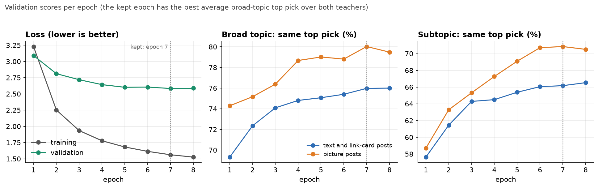
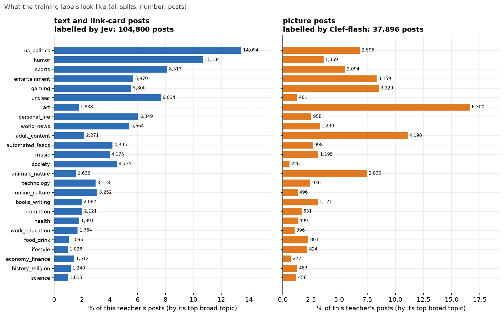
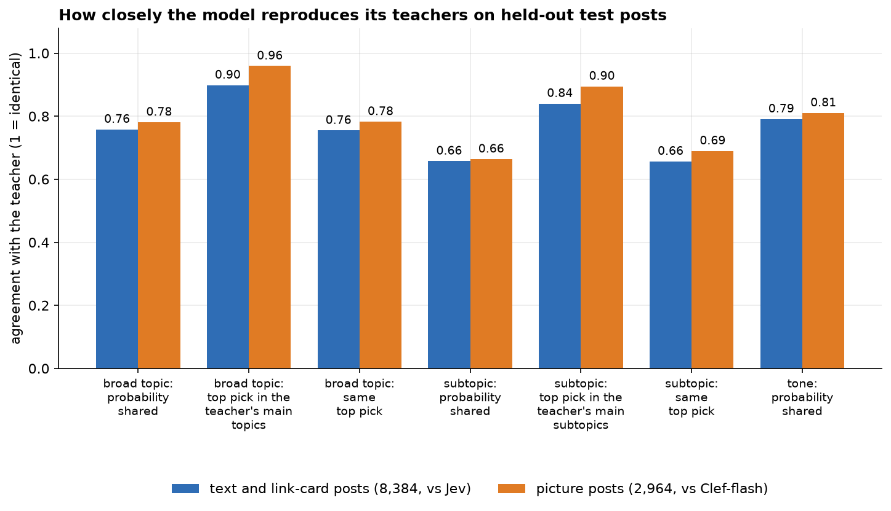
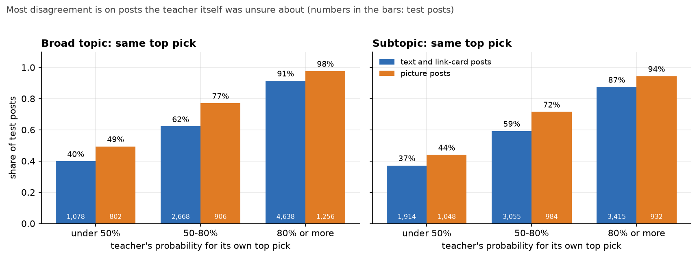
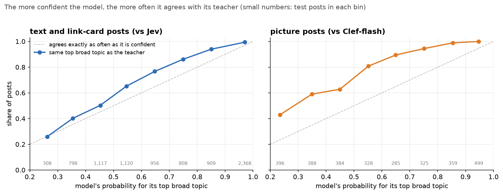
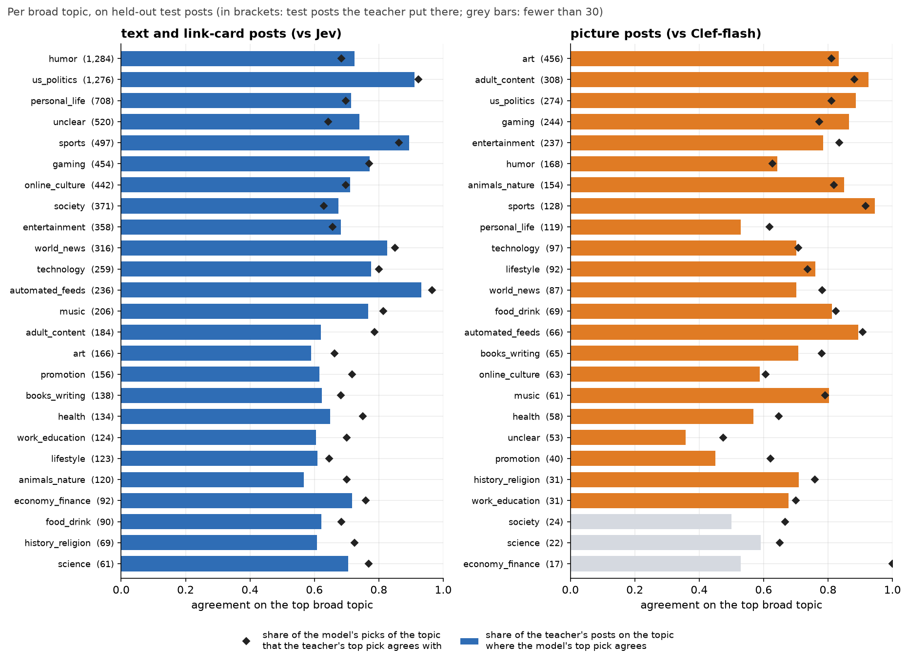
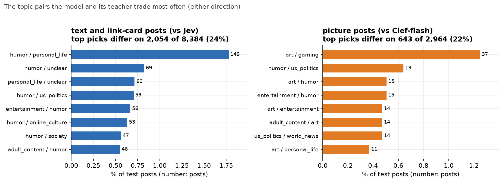
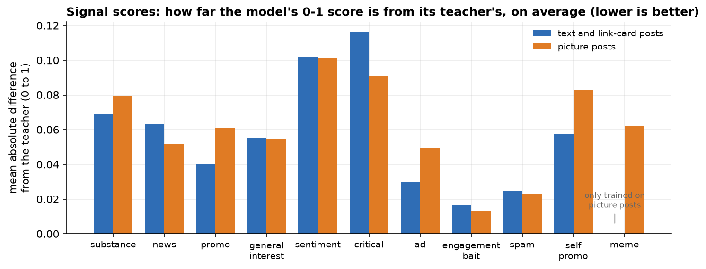

# microblog-topic-classifier-v5

Reads one short social-media post (its text, plus up to two pictures) and returns what it is about:

| output | what |
|---|---|
| `broad` | probabilities over 25 broad topics (`sports`, `us_politics`, `art`, ... `unclear`) |
| `paths` | probabilities over 118 subtopics (`sports/baseball`, `art/fan_art`, ...) |
| `signals` | 11 scores between 0 and 1: substance, news, promo, general_interest, sentiment, critical, ad, engagement_bait, spam, self_promo, meme |
| `tone` | probabilities over 6 tones: informative, humorous, personal, outraged, supportive, other |

The topic list (taxonomy v2.1) with every topic's name and description is in `topics.json`.

**Licence: MIT** (`LICENSE`). Parts that came from elsewhere keep their own licences: see "Licence and sources" below.

## How it works

- The post text (plus any alt text, link card, quoted post, hashtags; see `render_post` in `topic_classifier.py`) goes through
  a fine-tuned [Ettin-150M](https://huggingface.co/jhu-clsp/ettin-encoder-150m) text encoder, mean pooled.
- Each picture (at most two are used) goes through a **frozen** [SigLIP 2 so400m, 512 px](https://huggingface.co/google/siglip2-so400m-patch16-512)
  image encoder. Its embeddings are projected and averaged; one learned vector stands in when a post has no pictures.
- The text vector, the picture vector and their product go through a small network to four output heads.
- This repository holds the fine-tuned text encoder, the picture projection and the heads (`model.safetensors`, 151.8 M parameters).
  The SigLIP 2 weights are downloaded from their own repository the first time a picture is classified.
  On a post with pictures about 580 M parameters run in total; a post without pictures needs only the 150 M text encoder.

## Use

```python
import sys
from huggingface_hub import snapshot_download

folder = snapshot_download("haileyok/microblog-topic-classifier-v5")
sys.path.insert(0, folder)
from topic_classifier import TopicClassifier, render_post

clf = TopicClassifier.from_pretrained(folder)            # uses the GPU when there is one
post = {"text": "Great win for the Braves tonight", "media_kinds": ["image"]}
out = clf.predict([{"text": render_post(post, with_pictures=True), "pictures": ["braves.jpg"]}], top_k=3)
print(out[0]["top_broad"], out[0]["broad"], out[0]["signals"]["meme"])
```

`pictures` may be file paths, PIL images or encoded image bytes; a picture that cannot be read is skipped.
`predict_arrays(items)` returns NumPy arrays instead of dicts, plus `pictures_used` (how many of each post's
pictures could be read). `config.json` records the post document version (`postdoc_version`, `pd2`) that the
code rendering the text (`render_post`, or the Go `internal/postdoc` in the project that uses this model) must follow.

Needs `torch`, `transformers` (tested with 5.17.0), `safetensors`, `pillow`, `huggingface_hub`. `render_post` documents the post fields it reads
(`text`, `tags`, `media_kinds`, `labels`, `media_alts`, `link_domain`/`link_title`/`link_description`, `quote_text`, ...). For a post with pictures,
pass `with_pictures=True` and the pictures: text a description service found in the pictures is then left out, as in training.
For a text-only post leave `pictures` out. Broad and subtopic probabilities are temperature scaled (1.146 and 1.22, fitted on held-out
validation posts). Posts are cut to 1,800 characters and 512 tokens.

## How it was trained

Posts are public Bluesky posts from 2026-09-25 to 2026-09-29. The labels are not human labels: two LLM-based teachers each wrote a full probability list per post under taxonomy v2.1,
and the student was trained to reproduce those lists (soft cross-entropy on the broad and subtopic heads, weights 1 and 1; signals 0.5, tone 0.3;
each post weighted by the teacher's confidence, minimum 0.3).

| teacher | posts it labelled | rows |
|---|---|---|
| Jev | posts with text only or a link card | 104,800 |
| Clef-flash 9B | posts with attached pictures or video (shown to the teacher) | 37,896 |

Clef-flash's probabilities were calibrated to Jev's scale on 5,000 posts both had labelled before training.
Split by time within each teacher: 125,674 train, 5,674 validation, 11,348 test (the newest 8% of each teacher's posts).
8 epochs, batch size 32, learning rate 5e-5 for the text encoder and 1e-3 for the rest, bfloat16, one RTX 5090, 2,208 s. The epoch kept is the one
with the best validation broad-topic top pick averaged over the two teachers: the 7th (78.0%, against 77.7% for the 8th). One training run (one seed).
The signal head `meme` only saw labels on picture posts: for a post without pictures its output means nothing.





## Results

Measured on the held-out test posts, against the teacher that labelled each post (text and link-card posts 8,384 against Jev; picture posts 2,964 against Clef-flash).
**These measure how closely the model reproduces its teacher, not whether the answer is right.**

| | text posts | picture posts |
|---|---|---|
| broad topic, probability shared with the teacher's list (1 = identical) | 0.758 | 0.781 |
| broad topic, top pick is among the teacher's main topics (fewest topics holding 80% of its probability) | 90% | 96% |
| broad topic, top pick equals the teacher's top pick | 75.5% | 78.3% |
| subtopic, probability shared with the teacher's list | 0.658 | 0.664 |
| subtopic, top pick equals the teacher's top pick | 65.7% | 69.0% |
| subtopic, top pick is among the teacher's main subtopics | 84% | 90% |
| tone, probability shared | 0.791 | 0.811 |
| meme, ranking score (area under the ROC curve) | n/a | 0.970 |



For scale: the two teachers agree with each other less than that. Clef-flash (calibrated) and Jev, both labelling the same 5,000 text posts, share 0.683 of
their broad-topic probability, and Clef's top pick is among Jev's main topics 85% of the time.

Held-out test posts where the model's top broad topic fell **outside** the teacher's main topics: 849 of 8,384 text posts (10%) and 120 of 2,964 picture posts (4%).

Human check of this model (one rater, the project owner): 25 of those picture-post disagreements, shown blind as two unlabelled answers (model vs Clef-flash,
random order). Model better 6, Clef-flash better 8, both fine 2, neither 1, can't tell 8. Too few posts to separate them; it says the disagreements are not
mostly the model being wrong. There was no separate human check of this model on text posts.

Most of the disagreement is on posts the teacher itself was unsure about. When the teacher gave its top broad topic 80% or more, the model's top pick
matched it on 91% of text posts and 98% of picture posts; under 50%, on 40% and 49%.



The model's own probability is a usable guide: the higher it is, the more often the top pick matches the teacher's.



Per broad topic, and the topic pairs the model and its teachers trade most often (`humor` against `personal_life` leads on text posts, `art` against
`gaming` on picture posts):





Signal scores (0 to 1) are on average within about 0.01 to 0.12 of the teacher's, closest for `engagement_bait` and `spam`, furthest for `sentiment` and `critical`:



Full numbers, validation history and per-epoch scores: `metrics.json`.

## Limits

- Agreement with a teacher is not accuracy. Where both teachers are wrong in the same way, so is this model.
- The text encoder is English-only. Posts in other languages will be classified poorly (a multilingual encoder would be a drop-in replacement but was not trained).
- Needs a GPU for any reasonable speed on posts with pictures (the picture encoder alone ran at about 155 pictures/s on an RTX 5090).
- Trained on posts from about five days of one platform (2026-09-25 to 2026-09-29 UTC); topics, slang and events drift. The held-out test is the newest 8% of those
  posts, so it does not measure how the model holds up weeks later.
- `unclear` is a topic in its own right ("no discernible topic, or not enough content to tell": bare links, emoji-only reactions, fragments); do not treat it as an error.
- Single training run; differences of a point or two between this and other models are within noise.

## Files

`model.safetensors` weights · `config.json` labels, temperatures, limits · `topics.json` taxonomy v2.1 (ids, names, descriptions) ·
`topic_classifier.py` inference code · `text_encoder/`, `tokenizer/` from Ettin-150M · `metrics.json` training and test scores · `LICENSE` · `NOTICE.md` ·
`images/` the charts on this page, drawn with matplotlib from `metrics.json` and the model's probabilities on the test posts (every chart's numbers are
checked against `metrics.json` before it is drawn). No posts are included in this repository, and no post text appears in any chart.

## Licence and sources

MIT (`LICENSE`). Parts that came from elsewhere, credited in `NOTICE.md`: the fine-tuned text encoder was initialised from Ettin-150M, and
`text_encoder/` and `tokenizer/` are copies of its files (MIT); SigLIP 2 (Apache-2.0) is not included, `topic_classifier.py` downloads it from its own
repository. No posts or training labels are included.
